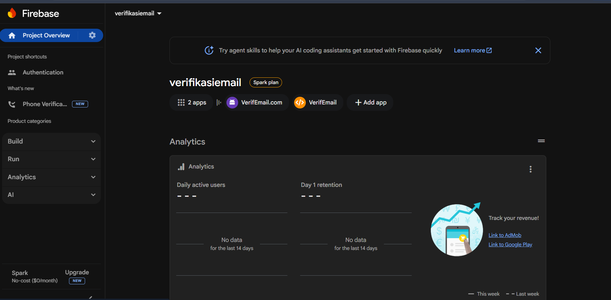
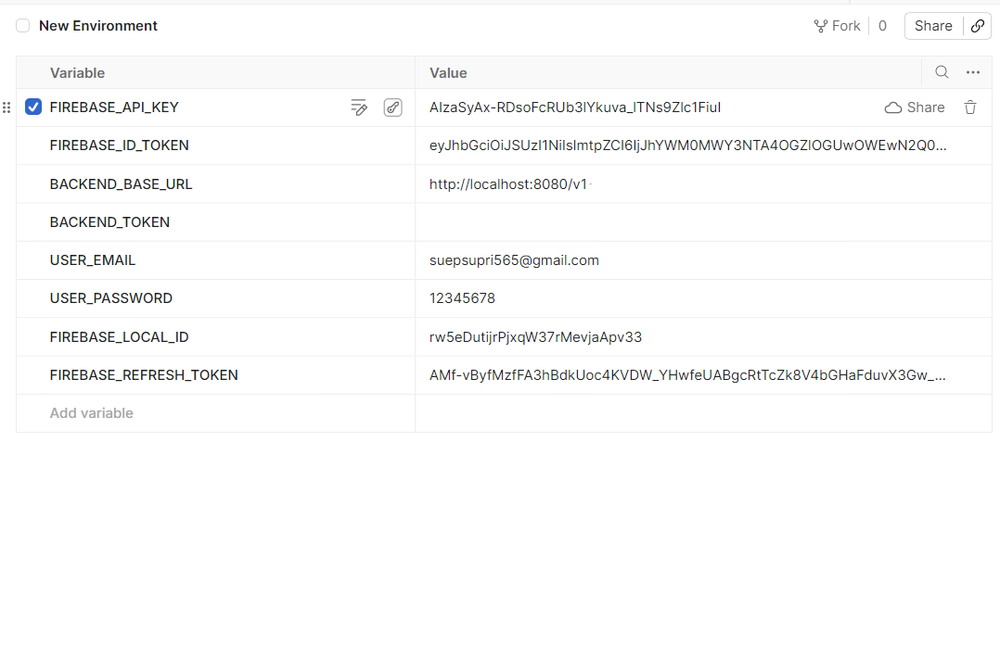
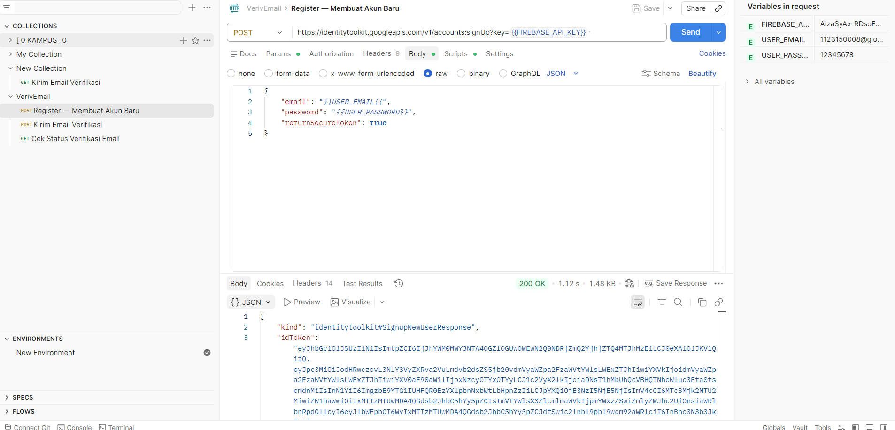
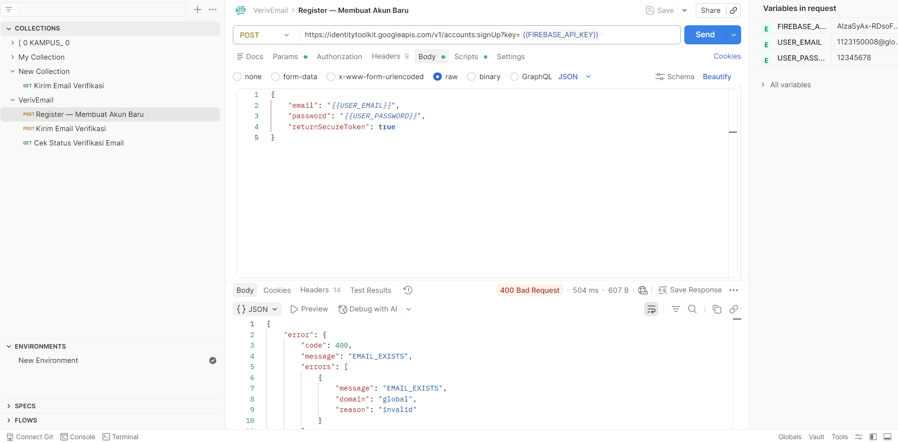
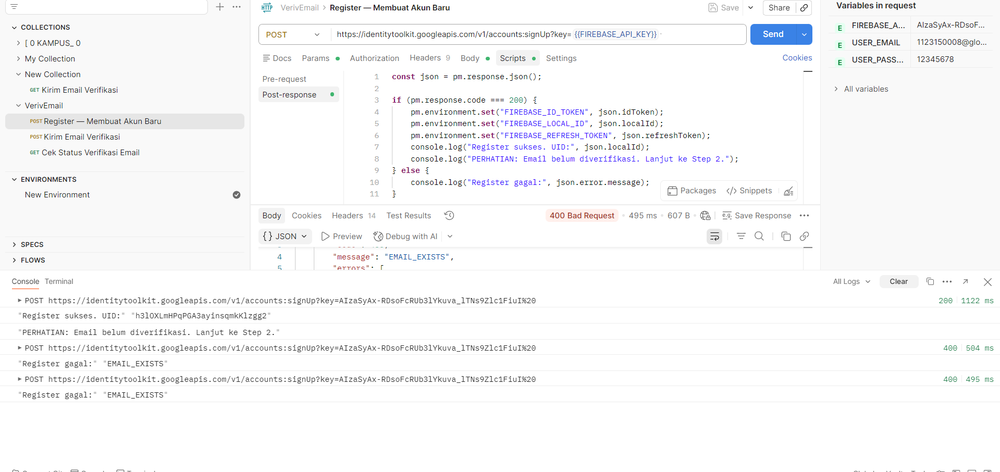
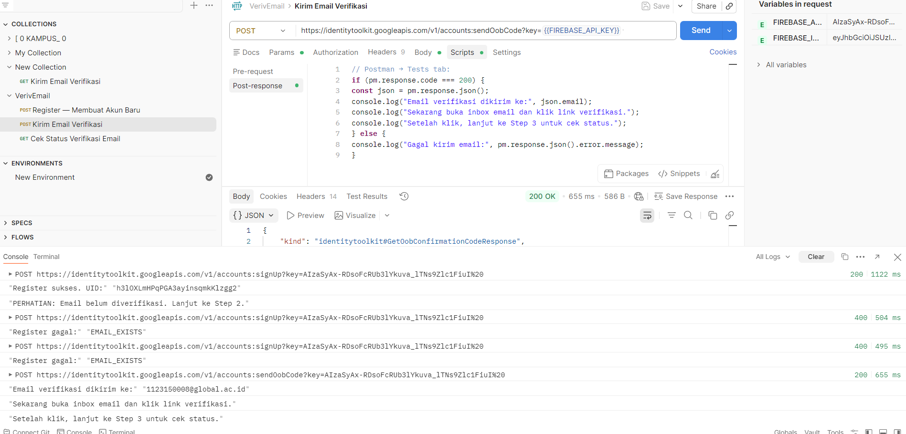
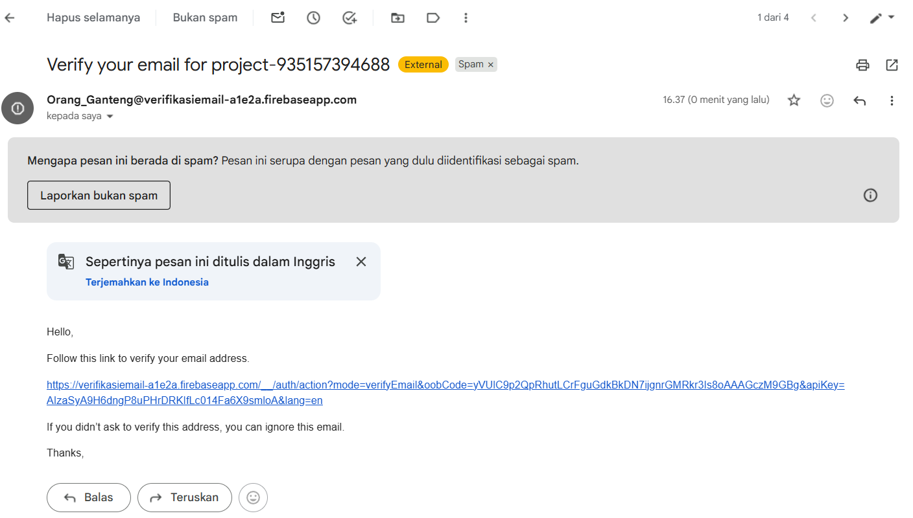

1. membuat project baru di console firebase

2. Setup Environment di Postman

3. Register — Membuat Akun Baru 
A. Response Sukses — 200 OK 

B. Response Error — Contoh 

C. Postman Test Script — Auto-save Token 

4. Kirim Email Verifikasi 

